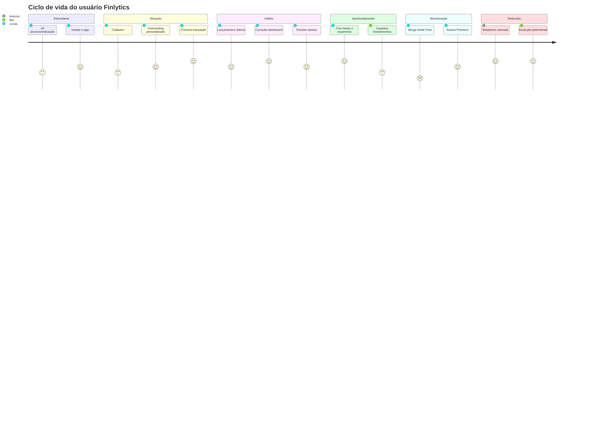
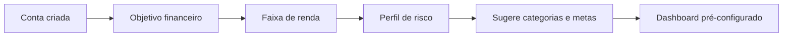

# 03 — Jornada do Usuário

Mapeamento ponta a ponta das jornadas principais, com fases, ações, pensamentos, emoções e oportunidades.

## Visão macro do ciclo de vida

---

## Jornada 1 — Primeiro acesso e Cadastro

| Fase | Ação do usuário | Pensamento | Emoção | Oportunidade de UX |
|------|-----------------|-----------|--------|--------------------|
| Splash | Abre o app | "Vamos ver se vale a pena" | 😐 Neutro | Logo + carregamento < 2s |
| Boas-vindas | Vê carrossel de valor (3 telas) | "Ah, dá pra ver cartão também" | 🙂 Curioso | Mostrar benefício, não features |
| Escolha | Toca em "Criar conta" | "Espero que seja rápido" | 😐 | Login social (Google/Apple) opcional |
| Cadastro | Preenche nome, e-mail, senha | "Mais um cadastro..." | 😕 Cauteloso | Validação inline, força de senha |
| Verificação | Confirma e-mail / código | "Burocracia" | 😕 | Deep link de verificação |
| Sucesso | Conta criada | "Pronto, e agora?" | 🙂 | Transição suave para onboarding |

**Métrica-chave:** taxa de conclusão do cadastro (meta > 70%).

---

## Jornada 2 — Onboarding (personalização)

- **Objetivo:** Economizar / Investir / Sair das dívidas / Organizar finanças.
- **Faixa de renda:** define escala de valores sugeridos e benchmarks.
- **Perfil:** Conservador / Moderado / Arrojado — ajusta sugestões de investimento.
- **Saída:** dashboard já personalizado + 1 meta sugerida + categorias ativas.

**Métrica-chave:** % que conclui onboarding e lança a 1ª transação (ativação).

---

## Jornada 3 — Uso diário (registro de transações)

| Fase | Ação | Emoção | Oportunidade |
|------|------|--------|--------------|
| Gatilho | Fez uma compra | 😐 | Atalho na home + widget de SO |
| Ação | Toca no botão "+" | 🙂 | FAB sempre acessível |
| Entrada | Valor → categoria → data | 🙂 | Teclado numérico, categoria sugerida |
| Confirmação | Salva | 😄 | Feedback tátil + saldo atualizado |
| Reforço | Vê impacto no saldo/orçamento | 😄 | Microcopy motivacional |

**Meta:** lançamento em < 10s; ≥ 3 lançamentos na 1ª semana.

---

## Jornada 4 — Consulta de relatórios

Usuário (Antônio/Marina) abre Relatórios → escolhe período (mensal/trimestral/anual) → visualiza gráficos de receita×despesa por categoria → exporta PDF/Excel → compartilha com contador/parceiro.

**Emoção:** sensação de controle e profissionalismo. **Oportunidade:** export rápido e relatório bem formatado com a marca.

---

## Jornada 5 — Controle de metas

Cria meta ("Reserva R$ 10.000", data-alvo) → app calcula aporte mensal necessário → a cada aporte, barra de progresso evolui → alerta se meta entra em risco → celebração ao concluir.

**Emoção:** motivação e conquista. **Oportunidade:** animação de progresso, badges.

---

## Jornada 6 — Controle de investimentos (Premium)

Bia cadastra ativos (CDB, Tesouro, FII, ações) → informa quantidade e preço médio → app calcula rentabilidade e lucro → consolida no patrimônio → mostra evolução patrimonial mensal.

**Emoção:** orgulho de ver o patrimônio crescer. **Oportunidade:** gráfico de evolução, alocação por classe, gatilho de upgrade para Premium.

---

## Pontos de fricção & mitigação
1. **Cadastro longo** → login social + campos mínimos.
2. **Lançamento manual cansativo** → categorias sugeridas, repetição de lançamentos, futura importação OFX/Open Finance.
3. **Limite do plano Free** → comunicar valor antes do paywall, teste grátis.
4. **Confiança em dados financeiros** → segurança visível (biometria, criptografia, selo LGPD).
