# 04 — Casos de Uso

Catálogo completo. Atores: **Visitante** (não autenticado), **Usuário Free**, **Usuário Premium**, **Sistema** (jobs/alertas), **Admin/Suporte**.

## Diagrama de casos de uso (visão geral)

```mermaid
flowchart TB
    subgraph Auth
      UC1[Criar conta]
      UC2[Fazer login]
      UC3[Login social]
      UC4[Recuperar senha]
      UC5[Configurar MFA]
      UC6[Logout]
    end
    subgraph Core
      UC10[Registrar receita]
      UC11[Registrar despesa]
      UC12[Editar transacao]
      UC13[Excluir transacao]
      UC14[Buscar/filtrar transacoes]
      UC15[Gerenciar categorias]
      UC16[Gerenciar cartoes]
      UC17[Planejar orcamento]
    end
    subgraph Growth
      UC20[Criar meta]
      UC21[Aportar em meta]
      UC22[Cadastrar investimento]
      UC23[Acompanhar patrimonio]
      UC24[Gerar relatorio]
      UC25[Exportar PDF/Excel]
    end
    subgraph Conta
      UC30[Editar perfil]
      UC31[Trocar tema/biometria]
      UC32[Gerenciar assinatura]
      UC33[Exportar/excluir dados LGPD]
    end
    Visitante --> UC1 & UC2 & UC3 & UC4
    Usuario --> UC10 & UC11 & UC12 & UC13 & UC14 & UC15 & UC16 & UC17 & UC20 & UC21 & UC24 & UC30 & UC31 & UC32 & UC33
    Premium --> UC22 & UC23 & UC25
    Sistema --> UC40[Gerar alertas] & UC41[Atualizar cotacoes] & UC42[Fechar fatura]
```

## Catálogo detalhado

### Autenticação & Conta
| ID | Caso de uso | Ator | Pré-condição | Fluxo principal | Pós-condição |
|----|-------------|------|--------------|-----------------|--------------|
| UC-01 | Criar conta | Visitante | — | Informa dados → valida → cria usuário → envia verificação | Conta criada (pendente verificação) |
| UC-02 | Fazer login | Visitante | Conta existe | Informa e-mail/senha → valida → emite JWT+refresh | Sessão ativa |
| UC-03 | Login social | Visitante | — | OAuth Google/Apple → cria/associa conta | Sessão ativa |
| UC-04 | Recuperar senha | Visitante | Conta existe | Informa e-mail → recebe link/código → define nova senha | Senha alterada |
| UC-05 | Configurar MFA | Usuário | Logado | Ativa TOTP/SMS → confirma código | MFA ativo |
| UC-06 | Logout | Usuário | Logado | Encerra sessão → revoga refresh | Sessão encerrada |

### Transações
| ID | Caso de uso | Ator | Regras |
|----|-------------|------|--------|
| UC-10 | Registrar receita | Usuário | valor>0, categoria do tipo receita, data válida |
| UC-11 | Registrar despesa | Usuário | valor>0, pode vincular a cartão/conta |
| UC-12 | Editar transação | Usuário | só do próprio usuário |
| UC-13 | Excluir transação | Usuário | soft delete, confirma ação |
| UC-14 | Buscar/filtrar/ordenar | Usuário | por período, categoria, tipo, texto |
| UC-15 | Lançamento recorrente | Usuário | gera transações futuras automaticamente |

### Categorias, Cartões e Orçamento
| ID | Caso de uso | Ator | Regras |
|----|-------------|------|--------|
| UC-20 | Criar/editar/excluir categoria | Usuário | Free: até 5 personalizadas; nome único por usuário |
| UC-21 | Cadastrar cartão | Usuário | banco, bandeira, limite, fechamento, vencimento; Free: 1 cartão |
| UC-22 | Acompanhar fatura do cartão | Usuário | limite usado/disponível, fatura atual e próxima |
| UC-23 | Definir orçamento mensal | Usuário | valor-limite por categoria; alerta ao atingir % |

### Metas, Investimentos, Patrimônio e Relatórios
| ID | Caso de uso | Ator | Regras |
|----|-------------|------|--------|
| UC-30 | Criar meta | Usuário | nome, valor-alvo, data-alvo; Free: 2 metas |
| UC-31 | Aportar em meta | Usuário | incrementa valor acumulado; calcula progresso |
| UC-32 | Cadastrar investimento | Premium | classe, ticker, quantidade, preço médio |
| UC-33 | Acompanhar rentabilidade | Premium | preço atual via cotação → lucro/rentabilidade |
| UC-34 | Acompanhar patrimônio | Premium | soma contas + investimentos − dívidas |
| UC-35 | Ver evolução patrimonial | Premium | snapshot mensal histórico |
| UC-36 | Gerar relatório | Usuário | mensal/trimestral/anual |
| UC-37 | Exportar PDF/Excel | Premium | gera arquivo, salva/compartilha |

### Assinatura & LGPD
| ID | Caso de uso | Ator | Regras |
|----|-------------|------|--------|
| UC-40 | Assinar Premium | Usuário | IAP mensal/anual; 7 dias trial anual |
| UC-41 | Cancelar/gerenciar assinatura | Premium | mantém acesso até expirar |
| UC-42 | Exportar meus dados (LGPD) | Usuário | gera arquivo com todos os dados |
| UC-43 | Excluir conta e dados (LGPD) | Usuário | anonimiza/remove após carência |

### Sistema (automações)
| ID | Caso de uso | Gatilho |
|----|-------------|---------|
| UC-50 | Gerar alertas (orçamento, fatura, meta) | job agendado / evento |
| UC-51 | Atualizar cotações de ativos | job diário/intradiário |
| UC-52 | Fechar fatura do cartão | job no dia de fechamento |
| UC-53 | Snapshot patrimonial mensal | job no 1º dia do mês |

## Exemplo de caso de uso expandido — UC-11 Registrar Despesa

- **Ator principal:** Usuário autenticado.
- **Pré-condições:** sessão válida; ao menos uma categoria de despesa.
- **Fluxo principal:**
  1. Usuário toca no FAB "+" → seleciona "Despesa".
  2. Informa valor, categoria (sugerida), data (padrão hoje), descrição opcional.
  3. (Opcional) vincula a um cartão de crédito.
  4. Confirma → sistema valida (valor>0, data válida).
  5. Sistema persiste, atualiza saldo/orçamento e, se cartão, atualiza limite usado.
  6. Retorna à lista com feedback de sucesso.
- **Fluxos alternativos:**
  - 4a. Valor inválido → mensagem inline, permanece na tela.
  - 3a. Orçamento da categoria estourado → grava e dispara alerta (UC-50).
- **Pós-condição:** transação criada; agregados atualizados.
