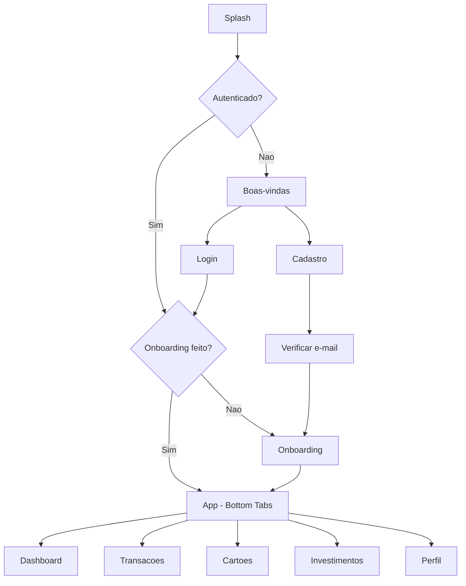
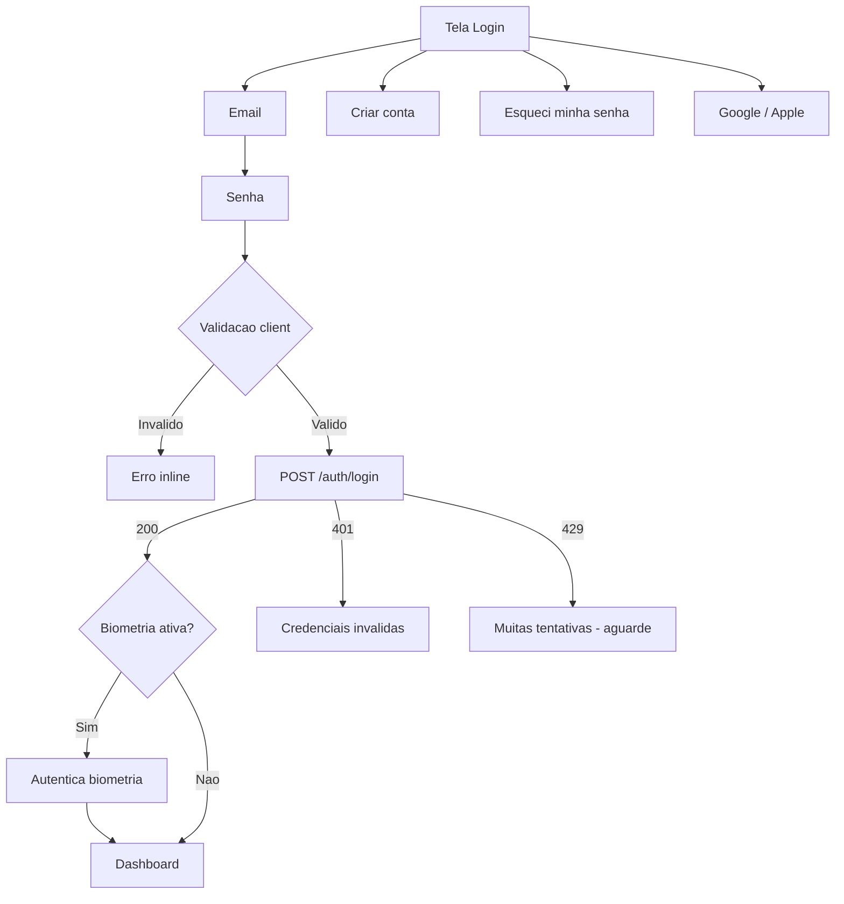
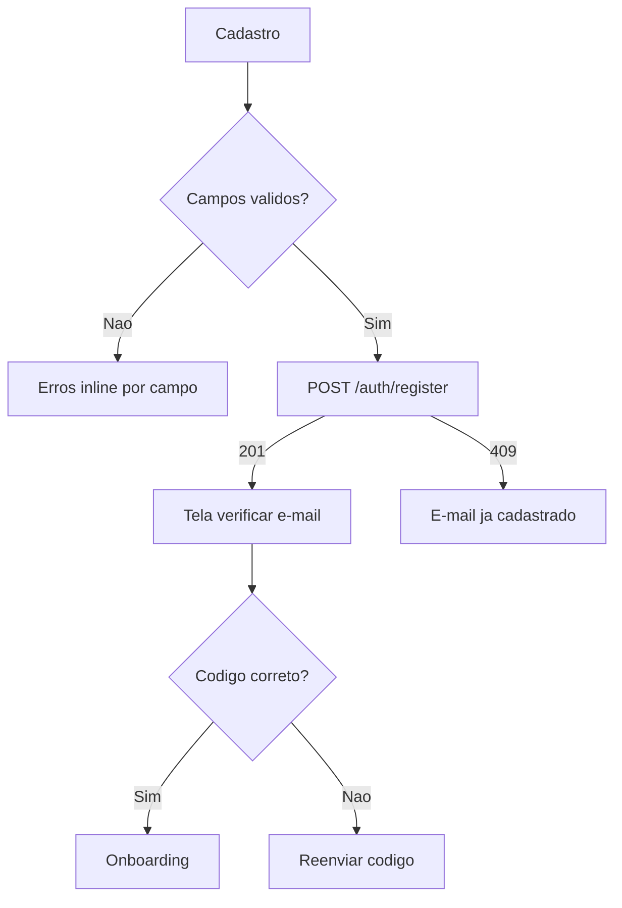
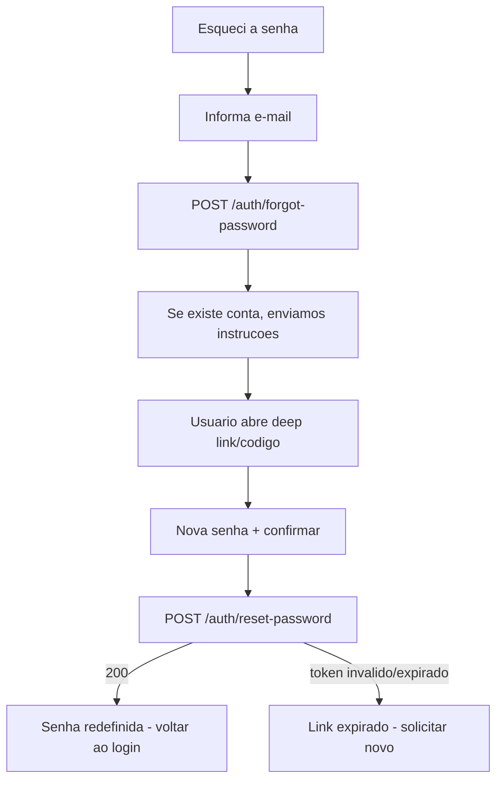
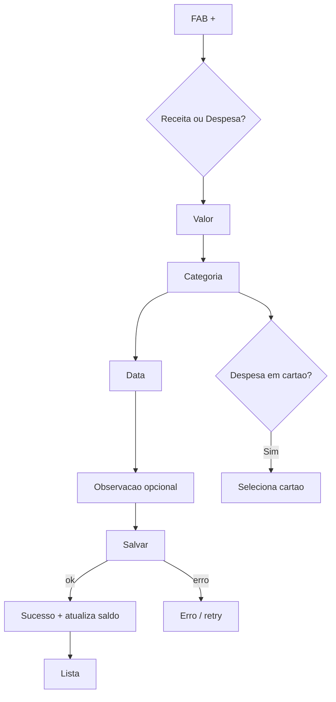
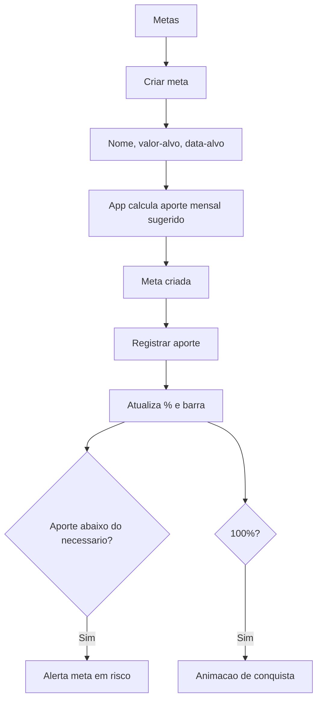
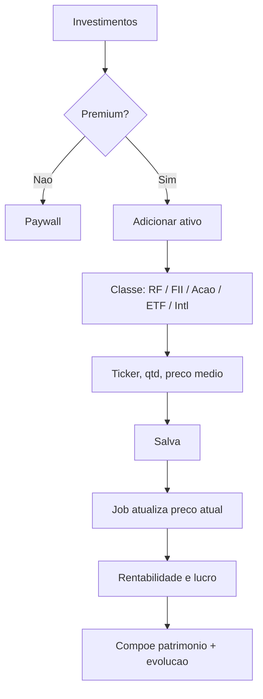

# 05 — Fluxos UX Completos

Notação: setas = navegação; losangos = decisão. Todos os fluxos consideram estados de erro, loading e vazio.

## Mapa de navegação global

A navegação principal usa **bottom navigation** com 5 abas: **Dashboard · Transações · (+) · Investimentos · Perfil**. O botão central "+" abre o modal de novo lançamento.

---

## Fluxo de Autenticação

### Splash
- **Elementos:** logo centralizado, indicador de loading, versão no rodapé.
- **Lógica:** verifica token salvo (secure storage) → válido vai ao Dashboard; inválido/ausente vai a Boas-vindas. Timeout máximo 2s.

### Login

- **Campos:** E-mail (validação de formato), Senha (mín. 8, mostrar/ocultar).
- **Botões:** Entrar · Criar conta · Esqueci minha senha · login social.
- **Estados:** loading no botão, erro inline, rate-limit.

### Cadastro
- **Campos:** Nome, Sobrenome, E-mail, Telefone, Senha, Confirmar senha.
- **Validações:**
  - Nome/Sobrenome: obrigatórios, 2–50 caracteres.
  - E-mail: formato válido, único (verificado na API).
  - Telefone: máscara BR `(99) 99999-9999`, opcional mas validado se preenchido.
  - Senha: mín. 8, ao menos 1 maiúscula, 1 número e 1 símbolo; medidor de força.
  - Confirmar senha: deve coincidir.
  - Aceite de Termos + Política de Privacidade (LGPD) obrigatório.

### Recuperação de senha

- **Segurança:** resposta genérica (não revela se e-mail existe), token de uso único com expiração de 30 min, invalida sessões ao redefinir.

---

## Fluxos das telas principais

### Novo lançamento (receita/despesa)

### Transações — busca/filtro/ordenação
- Lista paginada (infinite scroll), busca por texto, filtros (período, tipo, categoria, cartão), ordenação (data, valor). Swipe para editar/excluir. Estado vazio com CTA "Adicionar primeira transação".

### Metas

### Investimentos (Premium)

### Relatórios
- Seleciona período (mensal/trimestral/anual) → gráficos receita×despesa, por categoria, evolução → "Exportar" (PDF/Excel, gate Premium) → compartilhar.

### Perfil & Configurações
- Dados (nome, e-mail, plano), tema (claro/escuro/sistema), biometria, notificações, gerenciar assinatura, segurança (MFA, trocar senha), privacidade (exportar/excluir dados — LGPD), sair.
