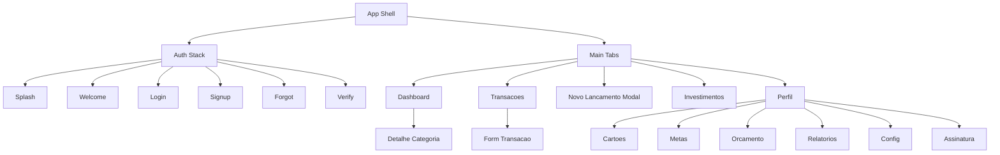

# 06 — Wireframes

Wireframes de baixa fidelidade (ASCII) + diagramas de hierarquia em Mermaid. Resolução base: 390×844 (mobile).

## Splash
```
┌───────────────────────────┐
│                           │
│                           │
│          ◆ Finlytics      │
│                           │
│           ( ⟳ )           │
│                           │
│                           │
│        v1.0.0             │
└───────────────────────────┘
```

## Login
```
┌───────────────────────────┐
│  ◆ Finlytics              │
│                           │
│  Bem-vindo de volta 👋    │
│                           │
│  E-mail                   │
│  [_______________________]│
│  Senha                    │
│  [______________]  👁      │
│              Esqueci senha │
│                           │
│  [        Entrar        ] │
│  ──────── ou ──────────   │
│  [ G  Google ] [  Apple ] │
│                           │
│  Não tem conta? Criar     │
└───────────────────────────┘
```

## Cadastro
```
┌───────────────────────────┐
│  ‹ Voltar     Criar conta │
│  Nome        Sobrenome    │
│  [________]  [_________]  │
│  E-mail                   │
│  [_______________________]│
│  Telefone                 │
│  [ (99) 99999-9999 ]      │
│  Senha            👁       │
│  [_______________________]│
│  força: ▓▓▓░░ Média       │
│  Confirmar senha          │
│  [_______________________]│
│  ☐ Aceito Termos e Política│
│  [      Criar conta      ]│
└───────────────────────────┘
```

## Onboarding (3 passos)
```
┌─────────────┐ ┌─────────────┐ ┌─────────────┐
│ Passo 1/3   │ │ Passo 2/3   │ │ Passo 3/3   │
│ Seu objetivo│ │ Sua renda   │ │ Seu perfil  │
│ ◉ Economizar│ │ ◉ Até 2k    │ │ ◉ Conservad.│
│ ○ Investir  │ │ ○ 2k–5k     │ │ ○ Moderado  │
│ ○ Sair dívid│ │ ○ 5k–10k    │ │ ○ Arrojado  │
│ ○ Organizar │ │ ○ +10k      │ │             │
│ [Continuar] │ │ [Continuar] │ │ [Concluir]  │
└─────────────┘ └─────────────┘ └─────────────┘
```

## Dashboard
```
┌───────────────────────────┐
│  Olá, Lucas      🔔  ⚙     │
│ ┌───────────────────────┐ │
│ │ Saldo atual           │ │
│ │ R$ 4.231,90           │ │
│ │ Patrimônio R$ 38.120  │ │
│ └───────────────────────┘ │
│ [Receitas]  [Despesas]    │
│  R$6.200     R$3.980      │
│  Economia do mês: R$2.220 │
│ ┌─ Despesas por categoria┐│
│ │     ◔ donut chart      ││
│ └───────────────────────┘ │
│ ┌─ Evolução patrimonial ─┐│
│ │     ╱╲___╱  line       ││
│ └───────────────────────┘ │
│ [🏠][📋][ + ][📈][👤]      │
└───────────────────────────┘
```

## Transações
```
┌───────────────────────────┐
│ Transações       🔍  ⌄    │
│ [Mês ▾][Tipo ▾][Categ ▾]  │
│ ───────────────────────── │
│ 🍔 Almoço      -R$ 32,00  │
│    Alimentação · 29/05    │
│ 💰 Salário    +R$6.200,00 │
│    Receita · 05/05        │
│ 🚗 Uber        -R$ 18,90  │
│    Transporte · 28/05     │
│ ...                        │
│ [🏠][📋][ + ][📈][👤]      │
└───────────────────────────┘
```

## Cartões
```
┌───────────────────────────┐
│ Cartões            + Novo │
│ ┌───────────────────────┐ │
│ │ Nubank · Mastercard   │ │
│ │ Usado R$1.240 / 5.000 │ │
│ │ ▓▓▓░░░░░░░ 25%         │ │
│ │ Fecha 03 · Vence 10   │ │
│ └───────────────────────┘ │
│ ┌───────────────────────┐ │
│ │ Itaú · Visa           │ │
│ │ ▓▓▓▓▓▓░░░ 60%          │ │
│ └───────────────────────┘ │
└───────────────────────────┘
```

## Metas / Investimentos / Relatórios
```
METAS                 INVESTIMENTOS         RELATÓRIOS
┌───────────────┐    ┌───────────────┐    ┌───────────────┐
│ Reserva       │    │ Patrimônio    │    │ [Mês][Tri][Ano]│
│ ▓▓▓▓▓░░ 68%   │    │ R$ 52.300     │    │  Receita x Desp│
│ R$6.8k/10k    │    │ +8,2% no ano  │    │   ║ ║ ║ bars   │
│ faltam R$3.2k │    │ ─ RF   40%    │    │  por categoria │
├───────────────┤    │ ─ FII  25%    │    │   ◔ donut      │
│ Viagem ▓░ 20% │    │ ─ Ações 35%   │    │ [Exportar PDF] │
└───────────────┘    └───────────────┘    │ [Exportar XLSX]│
                                          └───────────────┘
```

## Hierarquia de telas (Mermaid)


