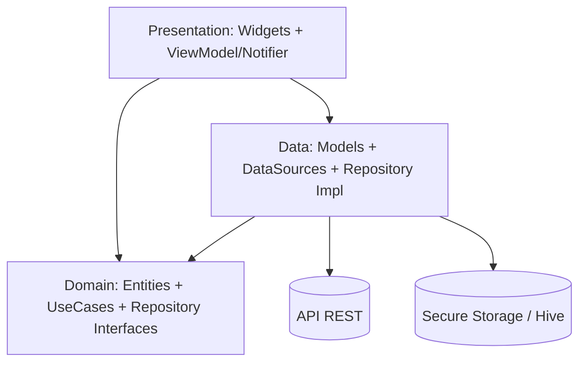
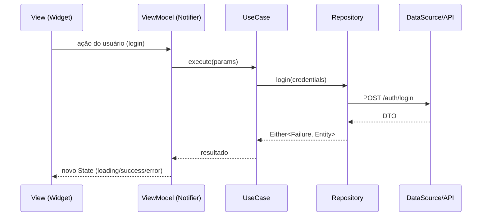

# 08 — Arquitetura Mobile (Flutter)

## Stack
- **Flutter** (Dart 3), Material 3.
- **Clean Architecture** + **MVVM** na camada de apresentação.
- **Feature-First**: cada funcionalidade é um módulo autocontido.
- **State management:** Riverpod (providers + notifiers como ViewModels).
- **Navegação:** go_router (rotas declarativas, deep links).
- **HTTP:** dio (interceptors de auth/refresh/log).
- **Local:** flutter_secure_storage (tokens), hive/isar (cache offline), shared_preferences (flags).
- **DI:** get_it + injectable (ou providers Riverpod).
- **Gráficos:** fl_chart. **i18n:** intl. **Biometria:** local_auth.

## Camadas (Clean Architecture)



- **Presentation:** Widgets (View) + ViewModel (Notifier) que expõe estado imutável (`AsyncValue`/`State`). Sem regra de negócio.
- **Domain:** puro Dart, sem dependência de Flutter — Entities, UseCases, contratos de Repository, Failures.
- **Data:** implementa repositórios, DataSources (remote/local), Models com (de)serialização e mapeamento para Entities.

## Estrutura de pastas
```
lib/
├── main.dart
├── app/                      # App root, router, theme bootstrap
│   ├── app.dart
│   └── router.dart
├── core/                     # transversal
│   ├── config/               # env, flavors
│   ├── error/                # Failure, Exceptions
│   ├── network/              # dio client, interceptors
│   ├── storage/              # secure storage, cache
│   ├── theme/                # cores, tipografia, ThemeData
│   ├── utils/                # formatters (moeda, data), validators
│   └── usecase/              # UseCase base
├── shared/                   # widgets/components reutilizáveis (DS)
│   └── widgets/
├── services/                 # serviços globais (analytics, notifications, biometrics, purchases)
└── features/
    ├── auth/
    │   ├── data/   (datasources, models, repositories)
    │   ├── domain/ (entities, repositories, usecases)
    │   └── presentation/ (pages, widgets, viewmodels)
    ├── onboarding/
    ├── dashboard/
    ├── transactions/
    ├── categories/
    ├── cards/
    ├── goals/
    ├── investments/
    ├── reports/
    ├── budget/
    ├── subscription/
    └── profile/
```

## Padrão MVVM (fluxo de dados)


## Tratamento de erro
- `Either<Failure, T>` (dartz) no domínio; ViewModel converte em estados de UI (loading/data/error) com mensagens amigáveis.

## Offline-first (estratégia)
- Cache de leitura (dashboard, transações recentes) em Hive; fila de sincronização para escritas feitas offline; reconciliação ao reconectar.

## Segurança no app
- Tokens em `flutter_secure_storage` (Keychain/Keystore).
- Interceptor de refresh transparente (401 → renova → repete).
- Biometria opcional para abrir o app e confirmar ações sensíveis.
- Certificate pinning opcional; ofuscação no build release.

## Testes (mobile)
- **Unit:** UseCases, ViewModels, mappers.
- **Widget:** componentes do DS e telas-chave.
- **Integration/E2E:** fluxos auth, lançamento de transação (flutter integration_test).
- Mock de DataSources com mocktail.

## Performance
- `const` widgets, lazy lists (`ListView.builder`), `cached_network_image`, evitar rebuilds (select/family no Riverpod), imagens otimizadas, code splitting por feature.
