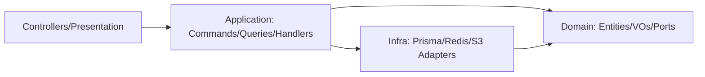
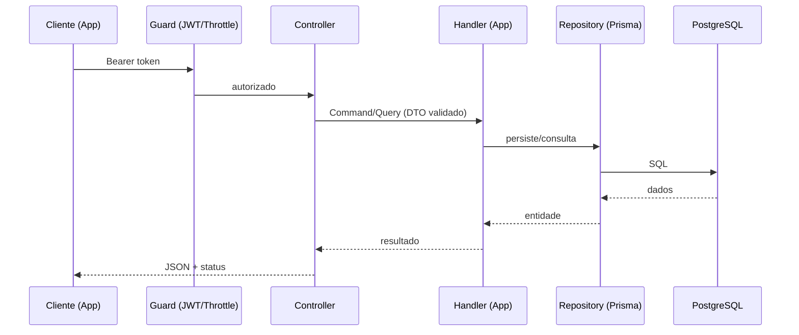
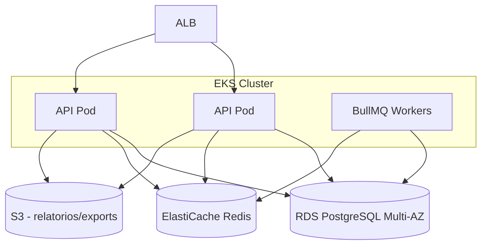

# 09 — Arquitetura Backend (NestJS)

## Stack
- **Node.js + NestJS + TypeScript.**
- **Clean Architecture + DDD + SOLID**, **Repository Pattern**, **CQRS** onde agrega valor (relatórios/leituras complexas).
- **ORM:** Prisma (PostgreSQL). **Cache/filas:** Redis (+ BullMQ). **Storage:** S3.
- **Auth:** JWT (access) + Refresh Token rotativo; Passport; MFA (TOTP).
- **Validação:** class-validator/zod. **Docs:** OpenAPI/Swagger.
- **Observabilidade:** Pino (logs estruturados), OpenTelemetry, health checks.

## Organização por módulos (DDD bounded contexts)
```
src/
├── main.ts
├── app.module.ts
├── config/                 # env, validação de config
├── common/                 # filters, guards, interceptors, decorators, pipes
│   ├── filters/            # http-exception, all-exception
│   ├── guards/             # jwt, roles, premium, throttler
│   ├── interceptors/       # logging, transform, timeout
│   ├── decorators/         # @CurrentUser, @Premium
│   └── errors/             # domain errors
├── infra/
│   ├── database/           # PrismaService, repositories impl
│   ├── cache/              # RedisService
│   ├── storage/            # S3Service
│   ├── queue/              # BullMQ processors
│   └── mail/               # mailer
└── modules/
    ├── auth/
    ├── users/
    ├── transactions/
    ├── categories/
    ├── cards/
    ├── budgets/
    ├── goals/
    ├── investments/
    ├── networth/           # patrimônio / evolução
    ├── reports/
    ├── alerts/
    ├── subscriptions/
    └── lgpd/               # exportação/exclusão de dados
```

### Anatomia de um módulo (ex.: transactions)
```
modules/transactions/
├── transactions.module.ts
├── domain/
│   ├── transaction.entity.ts          # regra de negócio pura
│   ├── transaction.repository.ts      # interface (port)
│   └── value-objects/ (Money, TransactionType)
├── application/
│   ├── commands/ (create, update, delete)  # CQRS write
│   ├── queries/  (list, summary)           # CQRS read
│   └── dtos/
├── infra/
│   └── prisma-transaction.repository.ts    # adapter
└── presentation/
    └── transactions.controller.ts
```

## Camadas e dependências (Clean)

Regra de dependência: tudo aponta para o **domínio**; o domínio não conhece frameworks.

## CQRS (onde aplicar)
- **Commands:** criação/edição/exclusão (transações, metas, investimentos).
- **Queries:** dashboard, relatórios, evolução patrimonial — leituras otimizadas, possivelmente materializadas/cacheadas no Redis.

## Fluxo de requisição


## Jobs/automação (BullMQ + Redis)
- Geração de alertas (orçamento/fatura/meta).
- Atualização de cotações de investimentos.
- Fechamento de fatura de cartão.
- Snapshot patrimonial mensal.
- Envio de e-mails (verificação, reset, relatórios).

## Infraestrutura (deploy)

- **Docker** para empacotamento; **Kubernetes (EKS)** para orquestração; **AWS** (RDS, ElastiCache, S3, ALB, CloudWatch).
- Escalabilidade horizontal (HPA), stateless API, sessões via JWT.
- CI/CD: lint+test+build → imagem → deploy (GitHub Actions/ArgoCD).

## Princípios SOLID aplicados
- **S:** handlers de comando/consulta com responsabilidade única.
- **O/L:** repositórios via interface, troca de adapter sem mudar domínio.
- **I:** ports segregadas por contexto.
- **D:** controllers/handlers dependem de abstrações (tokens de injeção do Nest).
