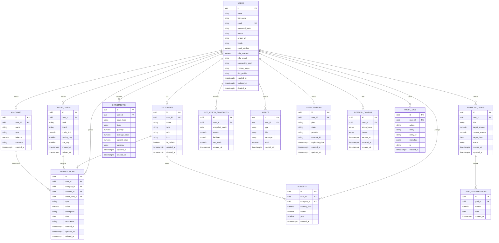

# 11 — Diagrama Entidade-Relacionamento (DER)

Modelo completo. Cardinalidades: um usuário possui muitas transações, categorias, cartões, metas, investimentos e uma assinatura.



## Dicionário (resumo de campos-chave)
- **transactions.type**: `income | expense`.
- **categories.type**: `income | expense | both`.
- **investments.asset_type**: `cdb | lci | lca | tesouro | fii | stock | etf | intl`.
- **subscriptions.plan**: `free | premium_monthly | premium_annual`; **status**: `active | trialing | past_due | canceled | expired`.
- **goals.status**: `active | completed | canceled`.
- **alerts.type**: `budget | invoice | goal | system`.

## DDL ilustrativo (trecho)
```sql
CREATE TABLE transactions (
  id            uuid PRIMARY KEY DEFAULT gen_random_uuid(),
  user_id       uuid NOT NULL REFERENCES users(id) ON DELETE CASCADE,
  category_id   uuid REFERENCES categories(id) ON DELETE SET NULL,
  credit_card_id uuid REFERENCES credit_cards(id) ON DELETE SET NULL,
  type          varchar(10) NOT NULL CHECK (type IN ('income','expense')),
  value         numeric(14,2) NOT NULL CHECK (value > 0),
  description   varchar(255),
  date          date NOT NULL,
  recurrence    varchar(20),
  created_at    timestamptz NOT NULL DEFAULT now(),
  updated_at    timestamptz NOT NULL DEFAULT now(),
  deleted_at    timestamptz
);
CREATE INDEX idx_trx_user_date ON transactions (user_id, date DESC) WHERE deleted_at IS NULL;
CREATE INDEX idx_trx_user_cat  ON transactions (user_id, category_id, date);
```
> Schema executável completo em [`backend/prisma/schema.prisma`](../backend/prisma/schema.prisma).
