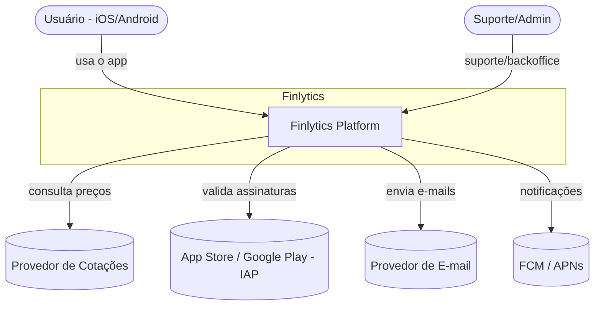
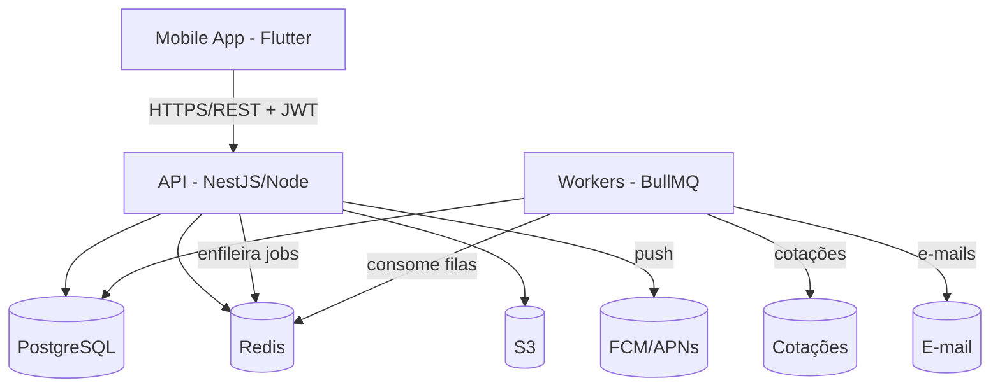
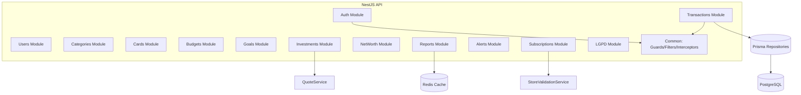
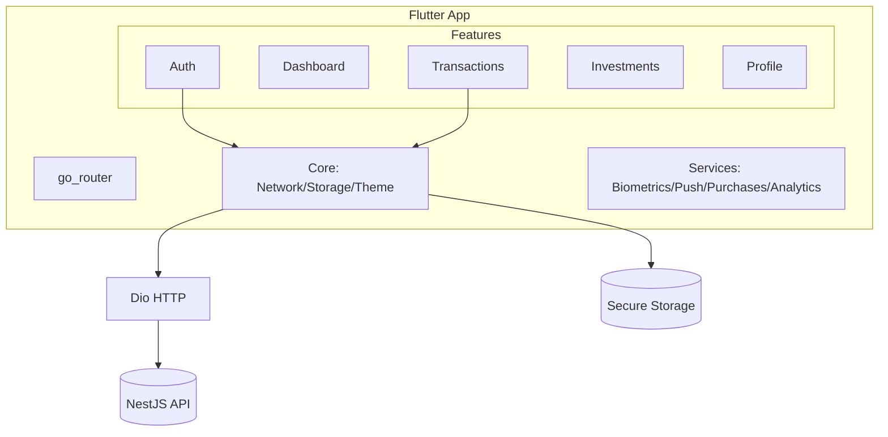

# 12 — Diagramas C4

Modelo C4 (Contexto → Container → Componente). Diagramas em Mermaid.

## Nível 1 — Contexto

## Nível 2 — Containers

## Nível 3 — Componentes (API)

## Nível 3 — Componentes (Mobile)

## Nível 4 — Código
Detalhado nas estruturas de pastas (doc 14) e no scaffold em `backend/` e `mobile/`.
