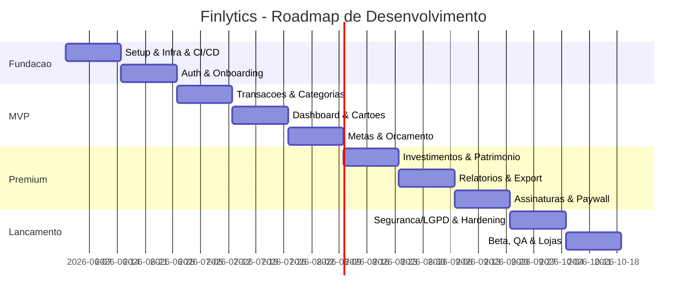

# 15 — Plano de Desenvolvimento por Sprints

Cadência: sprints de **2 semanas**. Time sugerido: 1 PM, 1 UX/UI, 2 mobile, 2 backend, 1 QA, 1 DevOps (parcial). Definition of Done: código + testes (≥95% nos módulos core) + revisão + docs + deploy em staging.

## Roadmap macro (releases)

## Detalhamento

**Sprint 0 — Fundação (infra/CI)**
Monorepo, Docker Compose (PG+Redis), Prisma schema base + migrations, esqueleto NestJS e Flutter, pipelines CI (lint/test/build), ambientes (dev/staging), observabilidade básica. *Entregável:* "hello world" deployado em staging.

**Sprint 1 — Auth & Onboarding**
Register/login/refresh/forgot/reset/verify, JWT+refresh rotativo, secure storage no app, telas splash/login/cadastro/recuperação, fluxo de onboarding (objetivo/renda/perfil), seed de categorias padrão. *Entregável:* usuário cria conta e entra.

**Sprint 2 — Transações & Categorias**
CRUD de transações (income/expense) + recorrência, CRUD de categorias, busca/filtro/ordenação, FAB de lançamento, validações. *Entregável:* registrar e listar movimentações.

**Sprint 3 — Dashboard & Cartões**
Agregados (saldo, receitas, despesas, economia), gráficos (donut/linha), cache Redis; CRUD de cartões, cálculo de fatura/limite, job de fechamento. *Entregável:* visão consolidada + cartões.

**Sprint 4 — Metas & Orçamento**
CRUD de metas + aportes + progresso + alerta de risco; orçamento por categoria + status + alerta de estouro; engine de alertas (BullMQ). *Entregável:* planejamento mensal funcional.

**Sprint 5 — Investimentos & Patrimônio (Premium)**
CRUD de investimentos por classe, serviço de cotações (job), rentabilidade/lucro, snapshots e evolução patrimonial. *Entregável:* carteira + patrimônio.

**Sprint 6 — Relatórios & Exportação (Premium)**
Relatórios mensal/trimestral/anual, geração PDF/Excel, upload S3, compartilhamento. *Entregável:* relatórios exportáveis.

**Sprint 7 — Assinaturas & Paywall**
Planos free/premium, IAP (App Store/Play), validação de recibo + webhooks, gating de features, paywall e trial. *Entregável:* monetização ativa.

**Sprint 8 — Segurança, LGPD & Hardening**
MFA (TOTP), rate limiting, criptografia de campos sensíveis, auditoria, exportar/excluir dados, biometria, pentest interno, perf tuning. *Entregável:* readiness de segurança.

**Sprint 9 — Beta, QA & Lojas**
E2E completos, correção de bugs, acessibilidade, store listings, screenshots, política de privacidade, beta (TestFlight/Play Internal), monitoramento. *Entregável:* submissão às lojas.

## Pós-lançamento (contínuo)
Open Finance (importação automática), conta compartilhada (casal), categorização por IA, web app, gamificação.
